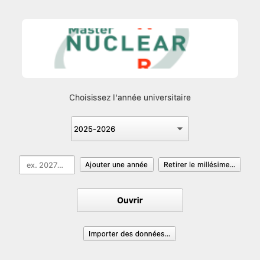
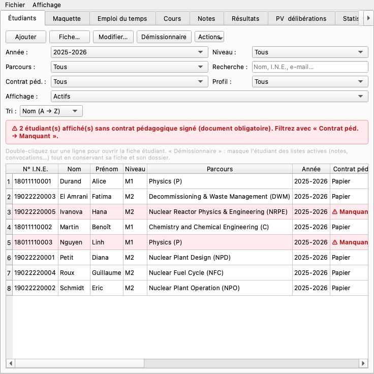
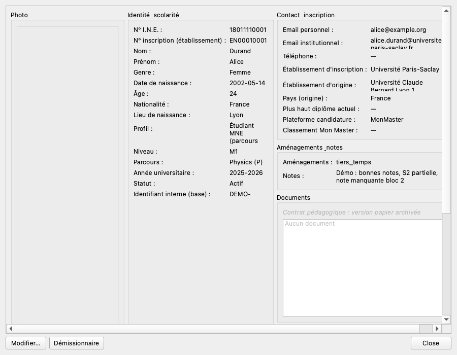
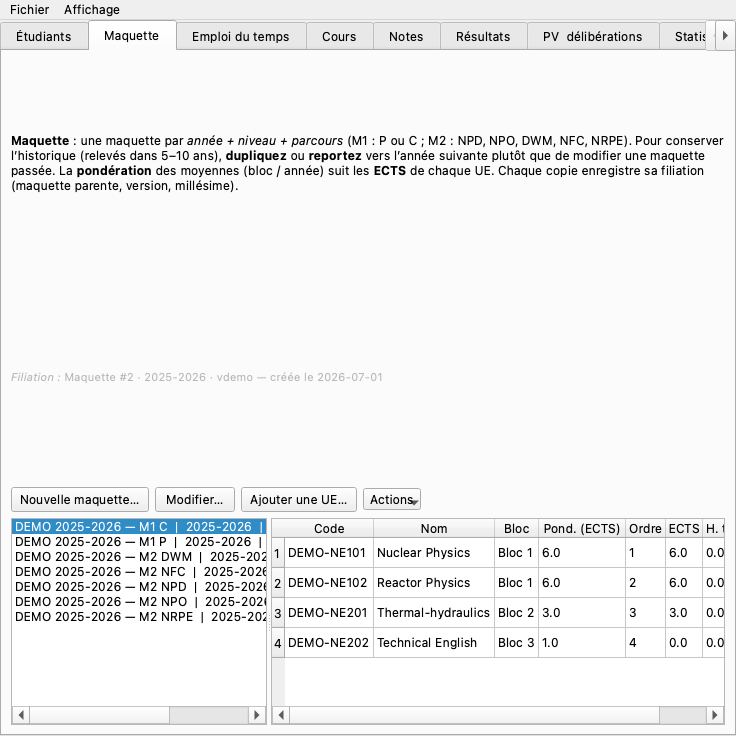
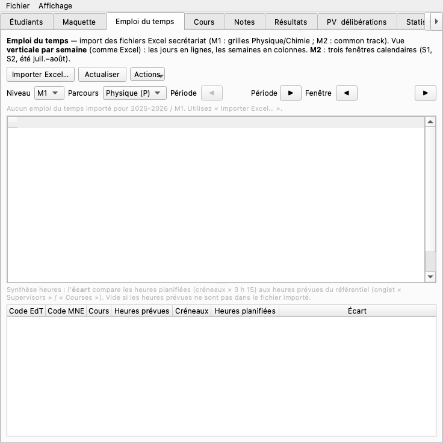
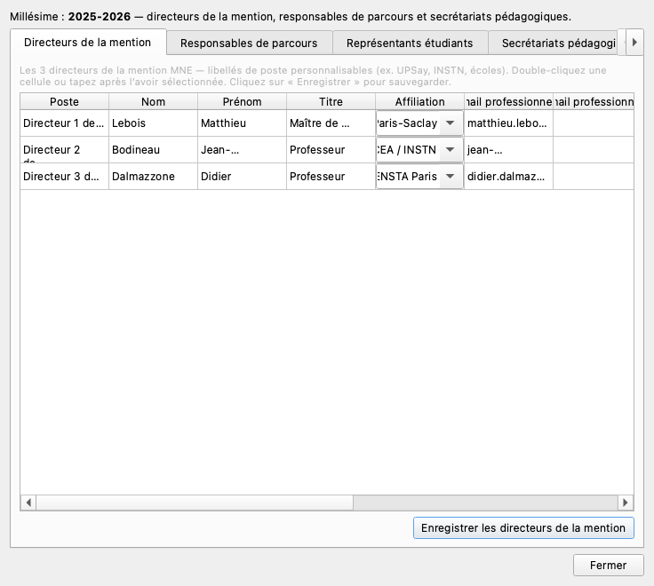
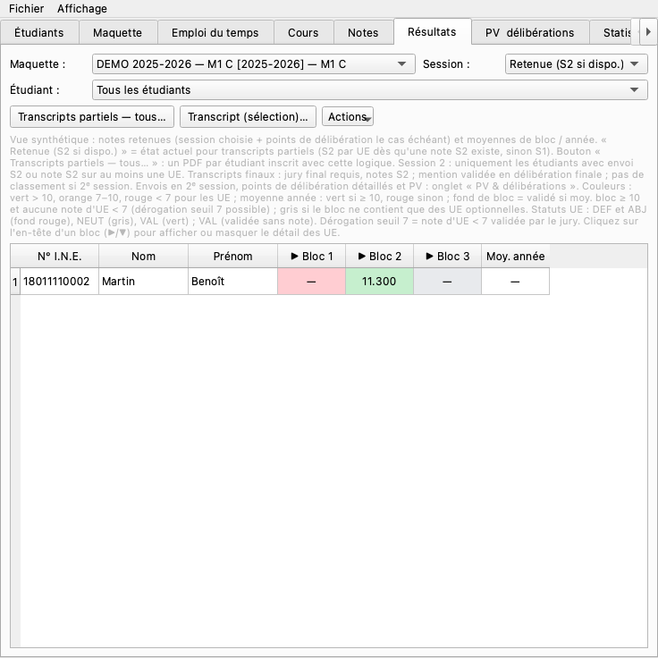
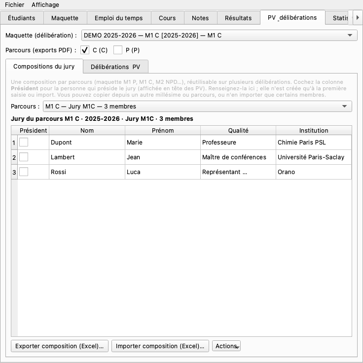

# MNE Grade Manager V3 — Manuel secrétariat

Guide illustré pour la gestion administrative du Master Nuclear Energy (MNE).  
Version du programme : **V3**.

> Les captures d’écran proviennent du programme réel (données de démonstration).  
> Pour les régénérer :  
> `PYTHONPATH=src .venv/bin/python scripts/capture_manual_screenshots.py`  
> **Versions Word / PDF** (images incluses) :  
> `PYTHONPATH=src .venv/bin/python scripts/export_manuel_secretaire.py`  
> → `docs/manuel_secretaire.docx` et `docs/manuel_secretaire.pdf`

---

## 1. À quoi sert ce programme ?

Centraliser, pour chaque **millésime** (ex. 2025-2026) :

- la **liste des étudiants** et leurs coordonnées ;
- les **maquettes** pédagogiques (UE, ECTS, heures) ;
- l’**emploi du temps** (import Excel) ;
- les **cours** et inscriptions ;
- les **notes**, **résultats**, exports Excel et documents de jury.

Les données sont enregistrées **sur l’ordinateur** (voir § 10).  
Une **sauvegarde complète** peut être transférée vers un autre PC (Mac ou Windows).

---

## 2. Démarrer

### Lancer l’application

| Plateforme | Méthode |
|------------|---------|
| **Mac (développement)** | `PYTHONPATH=src .venv/bin/python -m mne_grade_manager` |
| **Windows** | Double-clic sur `MNEGradeManager.exe` dans le dossier `MNEGradeManager\` (tout le dossier doit être copié, pas seulement le `.exe`) |

### Écran d’accueil

*Figure 1 — Choisir l’année universitaire, puis **Ouvrir**.*

1. Choisir l’**année universitaire** (ex. `2025-2026`).
2. Optionnel : saisir une année manquante (`2027-2028`) → **Ajouter une année**.
3. Cliquer sur **Ouvrir**.

Le bandeau titre affiche : `MNE Grade Manager V3 — 2025-2026`.

> **Important** : emploi du temps, équipe du master, etc. ne sont accessibles qu’**après** avoir ouvert un millésime.

**Importer des données…** (en bas de l’accueil) : restaure une sauvegarde `.zip` exportée depuis un autre ordinateur (voir § 10).

### Fenêtre principale

*Figure 2 — Onglets principaux. Menu **Fichier** en haut (Mac) ou dans la barre de menu Windows.*

**Retour à l’accueil** : *Fichier → Retour à l’accueil*.

Menu **Affichage** : raccourci pour passer d’un onglet à l’autre.

---

## 3. Menu Fichier (indispensable)

| Action | Usage secrétariat |
|--------|-------------------|
| **Exporter les données (transfert)…** | Sauvegarde complète (`.zip`) : base + photos + PDF. **Avant** tout gros import, changement de PC, ou envoi à un collègue Windows. |
| **Importer des données…** | Restaure une sauvegarde. **Écrase** les données locales du millésime importé. |
| **Enregistrer la base SQLite seule…** | Copie technique (sans photos ni pièces jointes). |
| **Équipe du master…** | Directeurs, responsables de parcours, secrétariats (figure 6). |
| **Tout actualiser** | Recharge les listes après une modification. |
| **Retour à l’accueil** | Changer de millésime. |

---

## 4. Onglet **Étudiants**

*Figure 3 — Boutons du haut, filtres, liste. Menu **Actions** à droite (flèche ▾).*

### Tâches courantes

| Bouton | Rôle |
|--------|------|
| **Ajouter** | Nouvel étudiant |
| **Fiche…** | Dossier en lecture seule (figure 9) |
| **Modifier…** | Coordonnées, parcours, niveau, pièces jointes |
| **Démissionnaire** | Retire de la liste active (sans supprimer le dossier) |

### Filtres (sous la barre d’outils)

- **Année**, **Niveau**, **Parcours**, recherche **Nom / prénom / e-mail**
- **Contrat péd.** : tous / manquant / OK
- **Affichage** : *Actifs* / *Démissionnaires* / *Tous*

### Menu **Actions** (bouton ▾)

| Action | Description |
|--------|-------------|
| **Modèle d’import Excel…** | Fichier vierge avec les colonnes attendues |
| **Importer Excel…** | Import ou mise à jour en masse |
| **Exporter Excel…** | Liste filtrée → Excel |
| **Importer dossiers candidature (PDF)…** | Extraction depuis les PDF d’admission |
| **Liste d’e-mails…** | Copie des adresses pour un mail groupé |
| **Marquer démissionnaire** / **Réintégrer** | Via la sélection multiple |
| **Passage M2 / redoublement…** | Fin d’année (avec le responsable pédagogique) |

### Colonne « Classement Mon Master »

Le modèle d’import Excel et la fiche étudiant incluent le champ **Classement Mon Master** (optionnel).  
Utile pour noter le rang sur la plateforme Mon Master ; peut être complété plus tard ou importé depuis Excel.

### Fiche étudiant

*Figure 9 — Consultation rapide : identité, contact, stages. **Modifier…** pour éditer.*

---

## 5. Onglet **Maquette**

*Figure 4 — Maquettes à gauche, détail des UE à droite. Menu **Actions** pour import/export Excel.*

Une maquette = **année + niveau + parcours** (M1 P ou C ; M2 NPD, NPO, DWM, NFC, NRPE).

### Bonnes pratiques

- **Ne pas modifier** une maquette d’année passée : **dupliquer** ou **reporter vers l’année suivante**.
- La filiation (maquette parente) est conservée.

### Import Excel

1. Sélectionner la maquette (colonne de gauche).
2. **Actions → Importer Excel (.xlsx)…**
3. Choisir le fichier officiel (maquette UPSay / OF PR1163…).
4. Vérifier l’aperçu (onglet, parcours, année) → valider.

**Actions → Exporter Excel (.xlsx)…** : copie de la maquette sélectionnée.

---

## 6. Onglet **Emploi du temps**

*Figure 5 — Import Excel, filtres parcours/période/semaine, grille et contrôle des heures.*

1. **Importer Excel…** → fichier secrétariat (ex. `Timetable-M1-2024-25- v1.xlsx`).
2. Filtres : **Niveau**, **Parcours** (Physique / Chimie), **Période** S1 ou S2 (*périodes calendaires*).
3. Choisir la **Semaine** → grille Lundi–Vendredi (matin / après-midi).
4. Tableau du bas : **heures prévues vs planifiées**.

> **Ré-import** : remplace l’emploi du temps du même millésime / niveau.

---

## 7. Onglet **Cours**

Arborescence **M1/M2 → blocs → parcours** ; fiches UE (code MNE, enseignant responsable, syllabus…).  
Permet de vérifier qu’une UE importée depuis la maquette est bien dans le catalogue.

---

## 8. Équipe du master

**Fichier → Équipe du master…**

*Figure 6 — Directeurs de la mention (postes personnalisables : UPSay, INSTN, écoles…).*

### Directeurs de la mention

- **Double-clic** sur **Poste**, Nom, Prénom, Email…
- Exemples de postes : *Directrice UPSay*, *Directeur INSTN*, *Directrice des écoles*
- **Enregistrer les directeurs de la mention**

### Responsables de parcours

Onglet **Responsables de parcours** : une ligne par M1 P, M1 C, M2 NPD… → double-clic + **Enregistrer**.

### Secrétariats pédagogiques

Onglet **Secrétariats pédagogiques** : **Ajouter**, cocher les parcours couverts, **Enregistrer**.

---

## 9. Onglet **Résultats** (exports)

*Figure 7 — Moyennes par bloc / UE. Menu **Actions** pour les exports.*

Usage principal secrétariat : **extraire les notes** pour le secrétariat universitaire ou archivage.

| Action (menu **Actions**) | Description |
|---------------------------|-------------|
| **Exporter CSV…** | Tableau synthétique (moyennes par UE / bloc) |
| **Exporter Excel (fichier de notes)…** | Classeur multi-feuilles type `Fichier_de_notes_M1NE` : liste étudiants, une feuille par UE, synthèses session 1 / 2 |
| **Transcripts partiels / finaux…** | PDF par étudiant (coordination pédagogique) |

Filtres utiles :

- **Maquette** : M1 P ou M1 C (l’export Excel regroupe tout le niveau M1 du millésime).
- **Session** : S1, S2 ou vue mixte.
- **Étudiant** : un seul dossier ou tous.

---

## 10. Où sont les données ?

| Système | Dossier |
|---------|---------|
| **macOS** | `~/.mne_grade_manager/` |
| **Windows** | `C:\Users\<nom>\.mne_grade_manager\` |

### Sauvegarde et transfert (Mac ↔ Windows)

1. **Exporter** : *Fichier → Exporter les données (transfert)…* → fichier `.zip`.
2. **Importer** sur l’autre PC : *Importer des données…* (accueil ou menu Fichier).

L’archive contient la base SQLite, les photos et les documents PDF.  
C’est la méthode recommandée pour installer l’exe Windows **avec** les données du master.

---

## 11. Onglet **PV & délibérations**

*Figure 8 — Coordination des jurys (plutôt responsables pédagogiques).*

Le secrétariat peut y consulter les **sessions de jury** et l’état des exports PDF ; la saisie des délibérations relève des responsables de mention / parcours.

---

## 12. Autres onglets

| Onglet | Rôle |
|--------|------|
| **Notes** | Saisie des évaluations (enseignants / coordination) |
| **Statistiques** | Effectifs, nationalités, réussite |

---

## 13. Convocations d’examen

- Objet du mail avec **code MNE** (ex. `M1B1-C-NUCL — …`).
- **Open in mail app** : ouvre Mail / Outlook avec les étudiants en **Cci**.

---

## 14. Messages techniques

| Message | Gravité |
|---------|---------|
| `TSMSendMessageToUIServer…` (Mac) | Bénin — clavier macOS |
| Antivirus bloque l’exe Windows | Ajouter une exception sur le dossier `MNEGradeManager` |

En cas de blocage : quitter complètement l’app, relancer, noter le message à l’écran.

---

## 15. Check-list début d’année

- [ ] Ouvrir le bon **millésime** (figure 1)
- [ ] **Exporter** l’année précédente (archivage) — § 10
- [ ] Importer **étudiants** (figure 3 → Actions)
- [ ] Importer **maquettes** (figure 4)
- [ ] Importer **emploi du temps** (figure 5)
- [ ] Compléter **équipe du master** (figure 6)
- [ ] Vérifier les **démissionnaires** (filtre Affichage)

---

## 16. Check-list fin d’année

- [ ] Marquer les **démissionnaires** définitifs
- [ ] **Exporter les données (transfert)** — § 10
- [ ] Export **fichier de notes Excel** si demandé par le secrétariat universitaire — figure 7
- [ ] **Passage M2 / redoublement** (avec le responsable pédagogique)

---

## 17. Évolutions prévues

- Emploi du temps M2 (nomenclature MNE à jour)
- Reports de cours (créneaux + e-mail enseignants)
- **Intervenants** multiples par UE

---

*Manuel secrétariat MNE V3 — captures dans `docs/images/manuel/`.*
